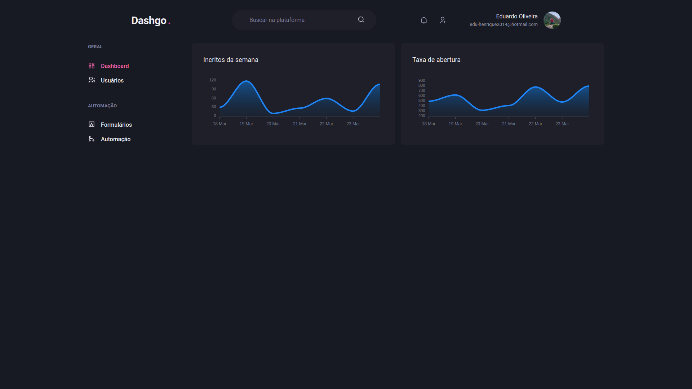

  

## About
A React and Next.js dashboard application. The project was built during the Ignite Bootcamp.

## Screenshots

### Login

### Dashboard

### Users list

### Create user

## Technologies
### React

### Next.js

### Chacka UI

### Typescript

## How to use it
1. Clone the project with `git clone https://github.com/Eduardo-H/dashgo`
2. Enter the project's directory with `cd dashgo/`
3. Install all the project's dependencies by running `yarn`
4. Run the project with `yarn dev`